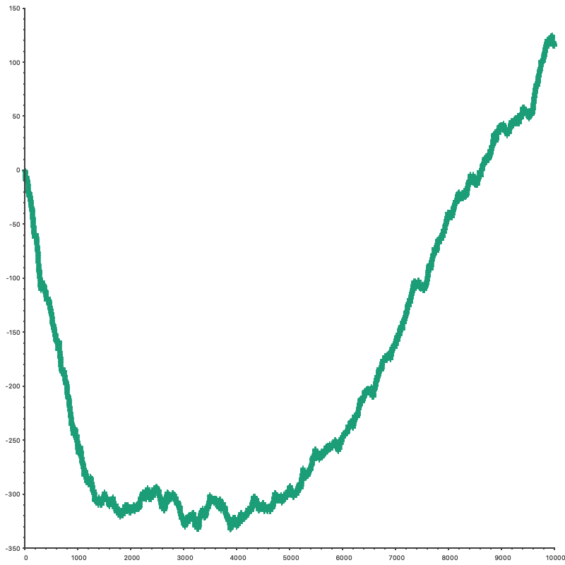

# Reinforcement learning applied to Tic-Tac-Toe
The following application applies at its most basic level some of the core concept of reinforcement learning in order to train a policy capable of playing the game of Tic-tac-toe autonomously. QLearning is the core learning algorithm employed in this project. Nonetheless it's fairly easy to implement new learning strategies and test them.

## Project structure
The code separates what is core reinforcement learning code from Tic-tac-toe domain-specific code.
The current RL class hierarchy makes it easy the addition of new agent or trainer types.

Currently there is one QLearning agent specialized for Tic-tac-toe in ```TicTacToeQLearner.h```. It accepts a QLearningSettings object containing all the training information needed by the learner.

There are two opponent types:
1. **Random**: At each step, it selects a random move sampled using a uniform distribution.
3. **Epsilon-Optimal**: At each step, it samples a number n between 0 and 1; if n < epsilon then it returns a random move, otherwise the optimal move is found using the minimax algorithm.

## Getting started
```
$ git clone --recurse-submodules https://github.com/gianmarcopicarella/tictactoe-reinforcement-learning.git
$ cd tictactoe-reinforcement-learning
$ cmake -S src -B build
$ cd build
$ make
```
At this point, calling ```$ ./tictactoe-rl train --help``` should print all the available parameteres.

## Running the application (CLI)
### Default settings
```
  // Go to main.cpp for more details
  gamma = 0.9;
  epsilon = 0.3;
  epsilonDecay = 0.000001;
  learningRate = 0.5;
  win, draw, lose, intermediate rewards = 1, 0, -1, 0.5;
  iterations = 50000;
  opponent = Random;
  agentSide = Cross;
  agentFirstToMove = true;
```

### Train and serialize an agent
When training an agent, ```--save``` is the only mandatory parameter. It specifies where the trained agent should be serialized once the training is completed. 
```
$ ./tictactoe-rl train --save ./policy.json
```
The trainer selected is random by default. Use ```--optimal eps``` if you want to use an optimal opponent with epsilon = eps.
```
$ ./tictactoe-rl train --optimal 0.2 --save ./policy.json
```

### Deserialize and test an agent
Similar to the training phase, ```--load``` is the only mandatory parameter. It specifies from where the trained agent should be deserialized.
```  
tictactoe-rl test --load ./policy.json
```
The trainer selected is random by default. Use ```--optimal``` if you want to use an optimal opponent with epsilon = 0.
```
tictactoe-rl test --optimal --load ./policy.json
```

### Plotting the cumulative reward function (CRF)
The CRF plot can be requested only during training through the ```--plotReward``` flag.
Once the training is completed, a GnuPlot window containing the CRF plot will pop-up.



### Plotting the cumulative episodes result (CER)
The CER plot can be requested only during training through the ```--plotResults``` flag.
Once the training is completed, a GnuPlot window containing the CER plot will pop-up.


## Contributing

Contributions are what make the open source community such an amazing place to be learn, inspire, and create. Any contribution is **greatly appreciated**.

1. Fork the Project
2. Create your Feature Branch (`git checkout -b feature/AmazingFeature`)
3. Commit your Changes (`git commit -m 'Add some AmazingFeature'`)
4. Push to the Branch (`git push origin feature/AmazingFeature`)
5. Open a Pull Request
